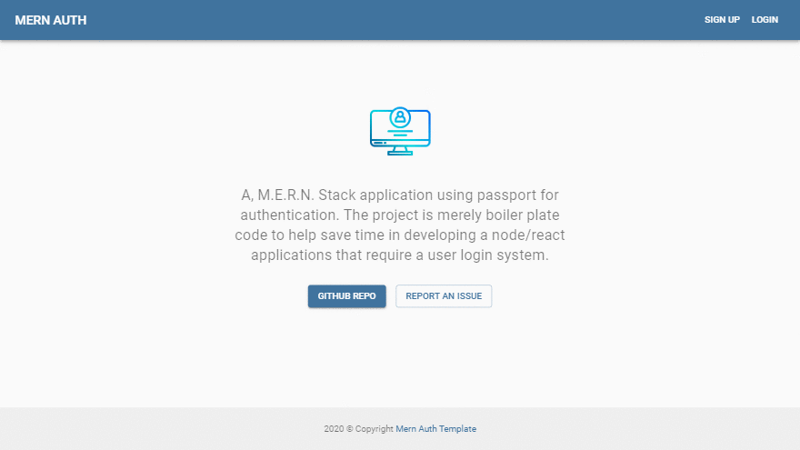

# :closed_lock_with_key: MERN Stack Passport Auth Boilerplate - This project is no longer in active development and will not receive future updates!



## About This Project

This is boilerplate code for a MERN stack authentication system using PasspportJS - Local Stratgey. The intent of this project is to create an easy to use, full featured, performant login system.

## Features
* Security
    * Passwords salt & hashed before storing in DB.
    * Sessions are time based & stored server side.
    * HTTP response headers set by Helment middleware to help prevent cross-site scripting attacks and other cross-site injections.
    * Client side login errors are ambiguous to prevent potential hackers from knowing if they have sucessfully captured a valid username.
    * Client side session cookie will not set, unless an SSL is established.
    * Password reset token are time based.
* Flexible UI
    * Use Material-UI to build complex app layouts which are mobile response or import your own libary and convert componets into HTML elements.
    * Material-UI allows you to setup custom themes & modes easily.
* Use of modern functional based components & hooks
    * To maintain consistency through the application
    * Allow you to further reduced the codebase by seperating similure functionailty into custom hooks
    * Hooks are just plain cool ;-)
* No Redux (uses Context API instead)
    * https://redux.js.org/faq/general#when-should-i-use-redux
* SoC
    * Server side uses MVC Architecture
    * Client side code seperated by concern making the app easier to scale, debug & maintain as your project grows.

## Issues
Found a bug? Report it [here](https://github.com/yeasir01/mern-stack-passport-auth/issues)

## Server Side Technologies
- Express
- Express-Sessions
- Passport & Passport-Local
- Bcrypt
- Mongoose & MongoDB
- Connect-Mongo
- Helmet
- Nodemailer
- Handlebars (email templating)

## Client Side Technologies
- React
- Material-UI
- Axios (Improved browser support)

## Starting the app locally
1) Download or clone this repository.
2) Create a .env file in the root directory.
3) Paste the following into the .env file.

```
MONGODB_URI = yourMongoAtlasURLAndPasswordHere
SESSION_SECRET = yourCustomSuperSecertPassPhraseHere
EMAIL_USERNAME = yourEmailHere
EMAIL_PASSWORD = yourEmailPasswordHere
```

4) Configure setup.json

```
{
    "site" : {
        "URL" : "https://mern-stack-pass-app.herokuapp.com",
        "appName" : "Awesome App"
    }, 
    "auth" : {
        "sessionTime": 30
    },
    "email": {
        "service": "SendGrid",
        "fromDisplayName" : "My Awesome App",
        "logo" : "https://s3.eu-west-2.amazonaws.com/glamcam.media/MyCompanyUS_5a5cee6bd3aed/campaign_assets/logo.png",
        "tokenTime" : 30
    }
}
```

Start by installing front and backend dependencies. While in the root directory, run the following command:

```
npm install
```

This should install node modules within the server and the client folder.

After both installations complete, run the following command in your terminal:

```
npm run dev
```

Your app should now be running on <http://localhost:3000>. The Express server <http://localhost:5000> should intercept any AJAX requests from the client.

## Deployment (Heroku)

To deploy, simply add and commit your changes then setup your environment variables on the settings page, & push to Heroku. The NPM scripts should take care of the rest.
