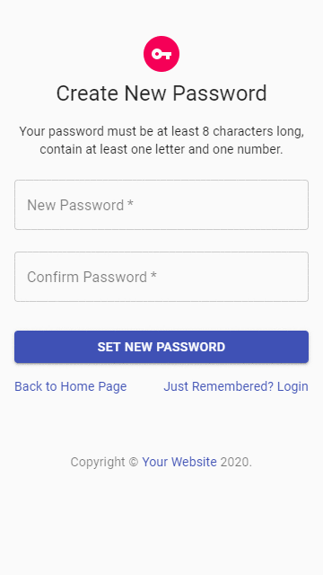
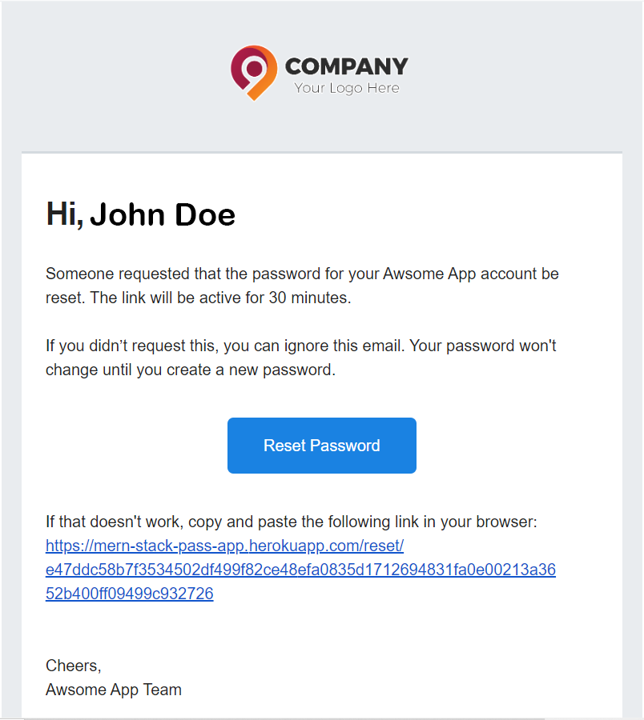

# :closed_lock_with_key: MERN Stack Passport Auth Boilerplate

 

## About This Project

This is boilerplate code for a MERN stack authentication system using PasspportJS - Local Stratgey. The intent of this project is to create an easy to use, full featured, performant login system.

## Project Goals
1) Security
2) Maximum flexibility
3) Small footprint w/minimal dependencies
4) Use all modern functional based components & hooks
5) Modern JS ES6 Syntax
6) No Redux (use context for state management)
7) Reduce or eliminate all unnecessary re-renders

## What is currently working?
- User registration
- Login
- Redirects to history URL after login
- Form validation (client & server side)
- Session cookies w/ttl
- Forgot password form
- Password reset form
- Templated email for password resets

## Issues?
Report [here](https://github.com/yeasir01/mern-stack-passport-auth/issues)

## Technologies (Server-Side)
- Express
- Express-Sessions
- Passport & Passport-Local
- Bcrypt
- Mongoose & MongoDB
- Connect-Mongo
- Nodemailer
- Handlebars (email templating)

## Technologies (Client-Side)
- React
- Material-UI
- Axios (Improved browser support)

## Starting the app locally
1) Download or clone this repository.
2) Create a .env file in the root directory.
3) Paste the following into the .env file.

```
MONGODB_URI = yourMongoAtlasURLAndPasswordHere
SESSION_SECRET = yourCustomSuperSecertPassPhraseHere
EMAIL_USERNAME = yourEmailHere
EMAIL_PASSWORD = yourEmailPasswordHere
```

Start by installing front and backend dependencies. While in the root directory, run the following command:

```
npm install
```

This should install node modules within the server and the client folder.

After both installations complete, run the following command in your terminal:

```
npm run dev
```

Your app should now be running on <http://localhost:3000>. The Express server <http://localhost:5000> should intercept any AJAX requests from the client.

## Deployment (Heroku)

To deploy, simply add and commit your changes then setup your environment variables on the settings page, & push to Heroku. the NPM scripts should take care of the rest.
